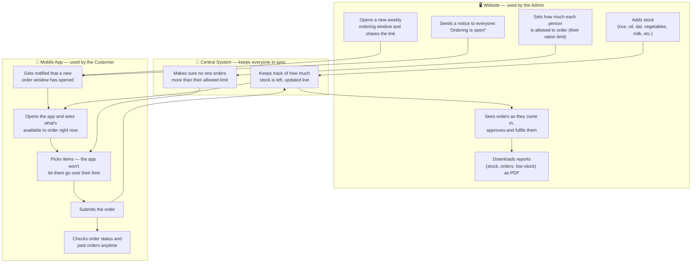
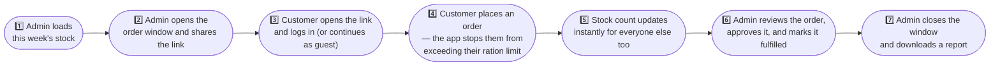

# StockFlow — Project Overview (for presentation)

*Reference document — problem statement, architecture, current features, and proposed roadmap. Written for a PPT on the StockFlow inventory & ration-ordering system built for an Indian Navy mess/canteen store.*

---

## 1. Problem Statement

Naval mess/canteen stores traditionally manage ration stock and daily/weekly ordering **manually** — paper registers for master stock, hand-tallied RIK (Ration-in-Kind) entitlement per officer/rating, and word-of-mouth or notice-board announcements when a new ordering window opens. This creates several recurring problems:

- **No live visibility of stock** — staff and customers (messes/units) cannot see real-time available quantity, leading to over-committing items that are already exhausted.
- **Manual RIK entitlement enforcement** — each officer/rating is entitled to a fixed daily ration scale (cereals, dal, oil, sugar, milk, meat, vegetables, etc.). Tracking this by hand per person, per week is slow and error-prone, and does not reliably prevent over-ordering beyond entitlement.
- **No audit trail** — stock changes (restocks, orders, adjustments) are not systematically recorded, making reconciliation and reporting difficult.
- **Delayed/inconsistent communication** — announcing a new weekly ordering window and its close, or notifying customers of order status, currently relies on ad-hoc channels.
- **No structured reporting** — generating stock, consumption, or order reports for review/audit is a manual, time-consuming exercise.

**StockFlow** solves this by digitizing the full loop: an admin loads master stock → opens a **live, shareable weekly order link** (optionally scoped to a ration zone/tier) → customers place orders against **real-time stock and their exact RIK entitlement**, which is enforced automatically → the admin gets a dashboard, PDF reports, and multi-channel broadcast tools to run the store efficiently and transparently.

---

## 2. How the Website and App Work Together (Simple Flow)

### 2.1 The big picture

*Everything the Admin does on the **website** and everything the Customer does on the **mobile app** stays connected through one central system — the moment something changes on one side, the other side sees it instantly.*

### 2.2 Step-by-step: a normal week

*A plain, numbered walkthrough of what happens from Monday to the end of the week.*

---

## 3. Current Features (Implemented)

### 3.1 Admin Web Console (Flutter Web)
- **Dashboard** — live-cycle banner with copyable order link, stock-alert banner (out-of-stock/low-stock counts), key stat tiles, a "needs attention" panel with inline restock actions, and a recent-orders feed.
- **Inventory / Master Stock** — full item catalogue with search, category filters, low/out-of-stock toggle, emoji/icon picker, reorder-level and current-quantity editing, and a "restock to opening" shortcut.
- **Bulk Excel/CSV Import** — upload a spreadsheet (with a downloadable template), preview parsed rows, choose "add to existing" or "replace," and apply in one action.
- **Ration Zones (RIK Entitlement Engine)** — Navy RIK (Ration-in-Kind) data for 17 official entitlement categories (cereals, dal, oil, sugar, milk, meat, vegetables, potato, onion, eggs, tea/coffee, fruit, dalia, butter, condiments, salt, LPG) is encoded with per-officer-per-day quantities and approved "in-lieu" substitute articles. This converts to a weekly ration cap per zone/tier (currently the "Officers" scale is fully populated). Admins can view/edit master ration limits, per-category caps, and per-item maximums per zone.
- **Order Links / Cycles** — generate multiple concurrent, optionally zone-scoped weekly order links; view Live vs Past cycles; open/close/reopen; view all orders and total units placed against a specific link.
- **Orders Management** — all orders with status filters (pending/confirmed/fulfilled/cancelled) and one-tap status transitions.
- **Users Management** — manage Staff and Customers separately; assign customers to a ration zone at creation.
- **Reports** — generate and download PDF reports: stock report, low-stock/reorder report, orders report.
- **Multi-channel Broadcast** — notify customers via In-app, SMS, WhatsApp, and Email (automatic SMTP delivery through a Supabase Edge Function, with manual deep-link fallback), plus a delivery-status confirmation view.
- **Settings** — store name, theme (light/dark), notification toggles, app version/about.
- **Platform-aware access** — the same app installed on a phone shows a reduced admin view (Dashboard, Zones, Inventory, Orders) with a banner directing full tools (Reports, Users, bulk import) to the website; the web console has the full feature set.

### 3.2 Customer App (Android + Web)
- **Onboarding & Auth** — first-run guided intro, login, registration (name/unit, phone, ration-scale/zone, address, email), and a "continue as guest" quick-start path.
- **Home** — order-window status card (open/closed with CTA), live catalogue preview, personal ordering activity/insights (top items, category breakdown, week-over-week trend via charts), quick reorder shortcuts, and a first-time "how ordering works" guide.
- **Ration-aware Ordering** — category-filtered product grid with live stock; a master-ration progress bar and per-category quota bars enforce the customer's exact RIK entitlement in real time, so a customer cannot exceed their allowance; approved "in-lieu" substitute items are flagged.
- **My Orders** — order history grouped by week/cycle with live/closed status.
- **Profile** — saved contact details, theme toggle, logout.
- **Live sync & notifications** — background polling plus Supabase Realtime keep stock and order status current; local push notifications alert customers to new broadcasts.

### 3.3 Backend (Supabase)
- PostgreSQL schema for items, stock, ration zones, order cycles, orders/order items, stock movements, profiles, and broadcasts.
- Row-Level Security enforcing role-based access (admin/staff full access, customers restricted to their own orders).
- Supabase Auth with session persistence.
- Realtime subscriptions for live stock/order sync across all connected clients.
- Edge Function for automated SMTP email broadcasts.

---

## 4. Possible Features to Add (Recommendations)

| Area | Proposed feature | Why it matters |
|---|---|---|
| **Entitlement engine** | Populate remaining ration tiers/ranks (currently only "Officers" is fully data-driven) | Full Navy deployment needs every rank/mess category covered, not just one tier |
| **Prediction & alerts** | Automated low-stock forecasting (consumption-rate based "days to stockout") with proactive push alerts to admin/staff | Blueprint already scopes this; prevents stock-outs before they happen instead of reacting to a dashboard banner |
| **Offline resilience** | Offline-first mode with local queue + sync-on-reconnect | Ships/units at sea or in low-connectivity areas need ordering/stock updates to work without continuous internet |
| **Staff (Worker) role** | Dedicated limited staff workflow — update stock, fulfil orders, restock — separate from full admin controls | Blueprint defines a Worker role distinct from Admin; currently staff mostly share the admin-limited view |
| **Push notifications** | Server-triggered push (FCM) instead of only local/foreground notifications | Ensures customers are notified of new order windows even when the app is fully closed |
| **Authentication** | OTP-based phone login for customers (instead of password-only) | Simpler, more secure onboarding for ratings/customers; matches an open decision already flagged in the blueprint |
| **Audit & compliance** | Full stock-movement audit trail UI (who changed what, when, why) and exportable audit reports | Important for defence-sector accountability and periodic audits |
| **Approval workflow** | Optional supervisor/Logistics-officer approval step for orders exceeding normal patterns | Adds a control layer suited to a defence procurement/mess environment |
| **Multi-unit / multi-store** | Support multiple messes/ships/units under one deployment with isolated stock and reporting | Roadmap already anticipates "multi-store" as a future phase |
| **Analytics** | Cross-cycle trend analytics (consumption forecasting, budget/spend tracking, seasonal patterns) | Turns historical order data into planning insight for procurement |
| **QR code sharing** | Auto-generate a QR code alongside each order link | Faster distribution on notice boards/mess halls without typing a URL |
| **Security hardening** | Optional deployment on an air-gapped/local network with hardened auth (CAC/ID-card-based) for classified or restricted environments | Matches typical defence IT security requirements beyond a public cloud backend |

---

*Document generated for presentation purposes — reflects the codebase state as of 2026-07-13.*
