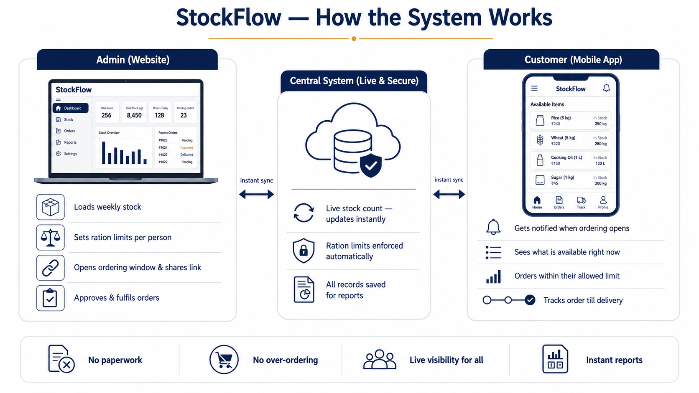
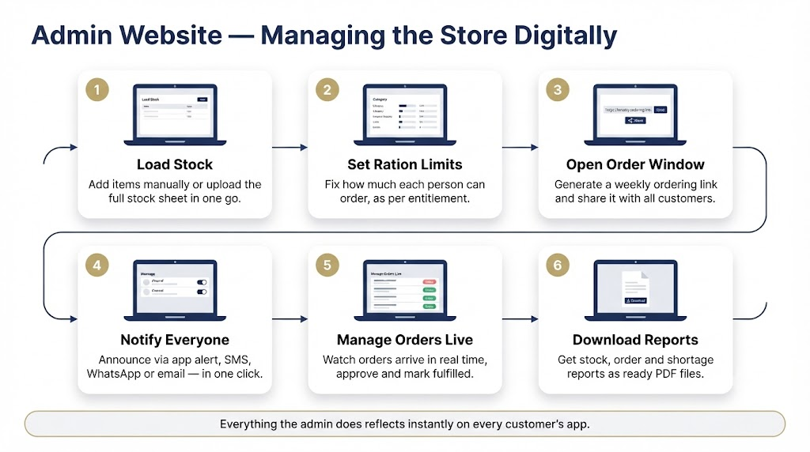
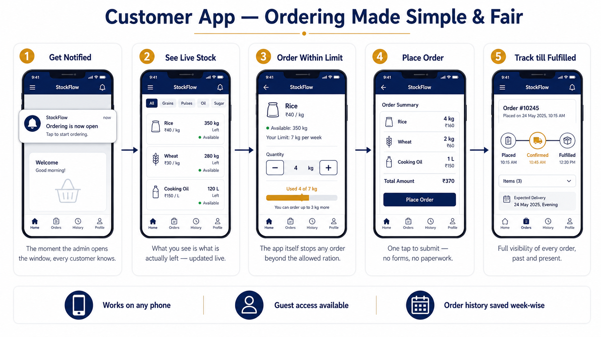
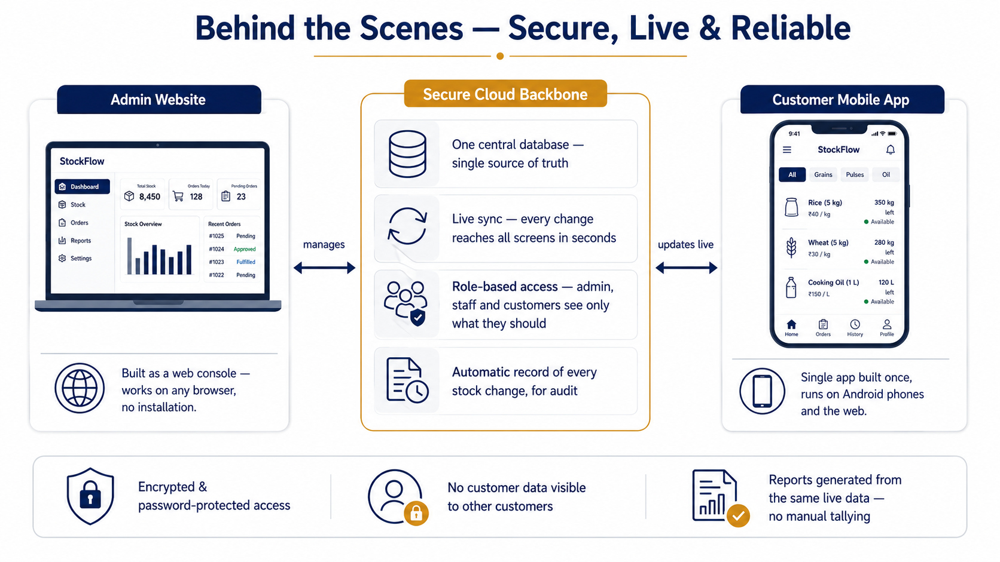

# StockFlow

### Digital Inventory & Ration Ordering System

*A single, presentation-ready document — written for a senior, non-technical audience. All four figures below were generated from the prompts in `IMAGE_PROMPTS.md`.*

---

## 1. The Problem We Are Solving

Naval mess and canteen stores today run largely on **manual, paper-based processes**, which creates five recurring difficulties:

| # | Problem | Impact |
|---|---------|--------|
| 1 | **No live visibility of stock** | Staff and customers cannot see what is actually left — items get over-committed after they are already exhausted |
| 2 | **Ration entitlement tracked by hand** | Each officer/rating has a fixed daily ration scale (RIK — Ration in Kind). Tallying it manually per person, per week is slow and error-prone |
| 3 | **No systematic record of stock changes** | Restocks, issues and adjustments are not consistently logged, making reconciliation and audit difficult |
| 4 | **Slow, informal communication** | Order windows and order status are announced by word of mouth or notice boards |
| 5 | **Manual reporting** | Stock, consumption and order reports are compiled by hand — time-consuming and inconsistent |

**StockFlow replaces this entire manual loop with one connected digital system:** the admin manages stock and opens a live weekly ordering window on a **website**, customers order through a **mobile app** that automatically enforces their exact ration entitlement, and every action is recorded and reportable — instantly, transparently, without paperwork.

---

## 2. The System at One Glance

StockFlow has **three connected parts** working together at all times:

- **The Admin Website** — where the store in-charge loads stock, sets ration limits, opens the weekly ordering window, manages orders and downloads reports.
- **The Customer Mobile App** — where every customer gets notified, sees live stock, orders within their allowed limit, and tracks their order.
- **The Central System** — the invisible link between the two: it keeps the stock count live, enforces the ration limits automatically, and saves every record for reports.

*Figure 1 — The complete system at one glance.*

---

## 3. Roles — Who Does What

| Role | Where they work | What they do |
|------|----------------|--------------|
| **Admin** (store in-charge) | Website (full control) | Loads master stock, sets ration limits per zone, opens/closes weekly ordering links, manages users, approves & fulfils orders, sends announcements, downloads reports |
| **Staff** | Website / App (limited view) | Assists with stock updates and order handling under the admin |
| **Customer** (officer / mess / unit) | Mobile App | Receives the order notification, views live stock, places orders within their ration limit, tracks order status, views past orders |

---

## 4. How the Admin Runs the Store — Website Flow

A normal week on the admin website, in six simple steps:

1. **Load Stock** — add items one by one, or upload the entire stock sheet (Excel/CSV) in one go.
2. **Set Ration Limits** — fix how much each person is allowed to order, exactly as per the official entitlement scale.
3. **Open the Order Window** — generate a weekly ordering link and share it with all customers.
4. **Notify Everyone** — one click sends the announcement through in-app alert, SMS, WhatsApp and email.
5. **Manage Orders Live** — watch orders arrive in real time; approve, fulfil or cancel with a tap.
6. **Download Reports** — get stock, order and shortage reports as ready PDF files.

*Figure 2 — Admin website flow, step by step.*

---

## 5. How the Customer Orders — App Journey

The customer's experience on the mobile app, in five simple steps:

1. **Get Notified** — the moment the admin opens the window, every customer is informed.
2. **See Live Stock** — the app shows exactly what is available right now, updated live for everyone.
3. **Order Within Limit** — the app itself prevents any order beyond the customer's allowed ration; a clear limit bar shows how much of the allowance is used.
4. **Place Order** — one tap to submit. No forms, no paperwork.
5. **Track Till Fulfilled** — the order moves visibly through *Placed → Confirmed → Fulfilled*, and the full week-wise history stays saved.

*Figure 3 — Customer app journey, step by step.*

---

## 6. What Is Already Built (Current Features)

### 6.1 Admin Website

- **Live Dashboard** — order-window status, stock alerts (low / out of stock), key numbers and recent orders on one screen, with a copyable order link.
- **Master Stock Management** — full item catalogue with search, category filters, quick restock, and reorder-level alerts.
- **Bulk Excel/CSV Import** — upload the entire stock sheet with a downloadable template, preview, and one-click apply.
- **Ration Entitlement Engine (RIK)** — the official entitlement scale (17 categories: cereals, dal, oil, sugar, milk, meat, vegetables, eggs, tea, fruit and more) is built into the system with per-person daily quantities and approved substitute ("in-lieu") articles. Admins can fine-tune overall, category-wise and item-wise limits per zone.
- **Weekly Order Links** — create multiple ordering windows, each optionally scoped to a ration zone; open, close or reopen anytime; see every order placed against each link.
- **Order Management** — all orders with status filters and one-tap transitions (pending → confirmed → fulfilled).
- **User Management** — add staff and customers; assign each customer to a ration zone.
- **PDF Reports** — stock report, low-stock/reorder report and orders report, downloadable instantly.
- **One-Click Announcements** — notify all customers through in-app alert, SMS, WhatsApp and email together, with delivery confirmation.

### 6.2 Customer Mobile App

- **Simple Onboarding** — guided first-run intro; register with name, unit, phone and ration scale — or continue as a guest.
- **Smart Home Screen** — order-window status, live catalogue preview, personal ordering insights (top items, weekly trends) and quick "order again" shortcuts.
- **Ration-Aware Ordering** — live stock with category filters; the master-ration bar and category quota bars make it impossible to exceed the entitlement; approved substitutes are clearly flagged.
- **Order History** — every order saved week-wise with live status.
- **Live Sync & Alerts** — stock and order status stay current automatically; notifications arrive even when the app is in the background.

---

## 7. Behind the Scenes — Simple, Secure, Reliable

The technology is kept deliberately simple to explain:

- **One central database** — a single source of truth for stock, orders and users; no duplicate registers.
- **Live sync** — any change made anywhere reaches every screen within seconds.
- **Role-based access** — admin, staff and customers each see only what they are permitted to; enforced at the data level, not just the screen level.
- **Automatic audit record** — every stock change is logged with who, what and when — ready for audit.
- **One codebase, every device** — the same system runs as a website for the admin and as an Android app for customers.

*Figure 4 — Behind the scenes, kept simple.*

---

## 8. The Road Ahead (Proposed Enhancements)

| Priority | Enhancement | Value |
|----------|-------------|-------|
| High | **All ration tiers/ranks** — extend the entitlement engine beyond the Officers scale to every rank and mess category | Full-scale deployment readiness |
| High | **Stock-out prediction** — automatic "X will finish in Y days" alerts based on consumption rate | Prevent shortages before they happen |
| High | **Offline mode** — ordering and stock updates that work without continuous internet and sync later | Essential for ships and low-connectivity locations |
| Medium | **Server push notifications** — alerts that reach customers even when the app is fully closed | No missed order windows |
| Medium | **OTP-based login** — phone-number OTP instead of passwords for customers | Simpler and more secure onboarding |
| Medium | **Approval workflow** — supervisor sign-off for unusual or oversized orders | Extra control layer for a defence environment |
| Medium | **Audit trail screen** — full visual history of every stock change, exportable for inspections | Defence-grade accountability |
| Future | **Multi-unit support** — several messes/ships/units under one system with separate stock and reports | Scale across the organisation |
| Future | **Advanced analytics** — consumption forecasting, seasonal patterns, budget tracking | Data-driven procurement planning |
| Future | **Hardened deployment** — option to run on a restricted/local network with ID-card-based access | Meets stricter defence IT requirements |

---

## 9. In One Line

> **StockFlow turns a paper-driven ration store into a live, fair and fully accountable digital system — stock loaded once, ordered within entitlement, tracked to the last kilogram, and reported in one click.**

---

*Prepared by SJCEM · StockFlow v1.1.0 · Document date: 13 July 2026*
